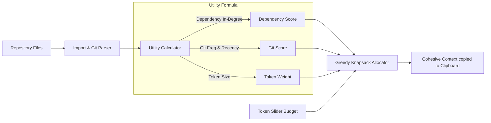

<p align="center">
  <h1 align="center">🎨 code-canvas</h1>
  <p align="center">
    <strong>The Visual, Token-Budget-Centric Codebase Context Packager for LLMs.</strong>
  </p>
  <p align="center">
    <a href="https://github.com/shivamtyagi18/code-canvas/stargazers"></a>
    <a href="https://github.com/shivamtyagi18/code-canvas/blob/main/LICENSE"></a>
    
  </p>
</p>

---

## 🚀 What is code-canvas?

**code-canvas** is an interactive local web interface designed to help you package codebase files into optimal prompt context files for LLMs (such as ChatGPT, Claude, and Gemini). Instead of blindly dumping your entire repository, you slide to your target token limit (e.g. 16k, 32k) and let our optimization algorithm automatically pick the most critical files for your context budget.



---

## ✨ Features

*   **📊 Token-Budget-Centric**: Slide to set your target token limit (8k, 16k, 32k, 128k) and watch the file tree automatically adjust to fit the budget.
*   **🧠 Intelligently Weighted Allocation**: Utilizes a greedy knapsack algorithm that maximizes code value density based on:
    *   **Dependency In-Degree**: Core files that are imported frequently receive higher priority.
    *   **Git Recency & Frequency**: Files modified recently or modified frequently in git history get boosted.
    *   **Dependency Propagation**: Selecting or pinning a file automatically boosts its dependencies.
*   **🖱️ Visual Toggle & Pinning**: Pin must-have files or exclude unwanted directories dynamically.
*   **☕ Premium Minimal Theme**: Styled in a comfortable, eye-friendly Latte and Dark Espresso palette with Sage Green accents.

---

## 📦 Quick Start

### Installation
Make sure you have Python 3 and Node.js installed.

1. **Clone the repository:**
   ```bash
   git clone https://github.com/shivamtyagi18/code-canvas.git
   cd code-canvas
   ```

2. **Run the developer startup script:**
   ```bash
   python3 run.py --dev
   ```
   This will automatically install backend Python requirements, setup frontend npm packages, start both servers, and open the visual dashboard in your browser.

---

## 🤝 Contributing

Contributions are welcome! Feel free to open an issue or submit a pull request. 

Give us a star ⭐ if you find this tool helpful!
